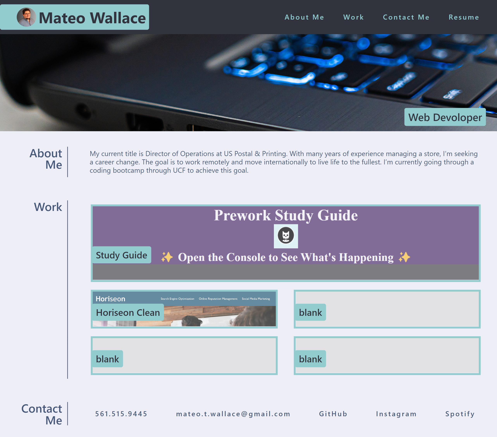
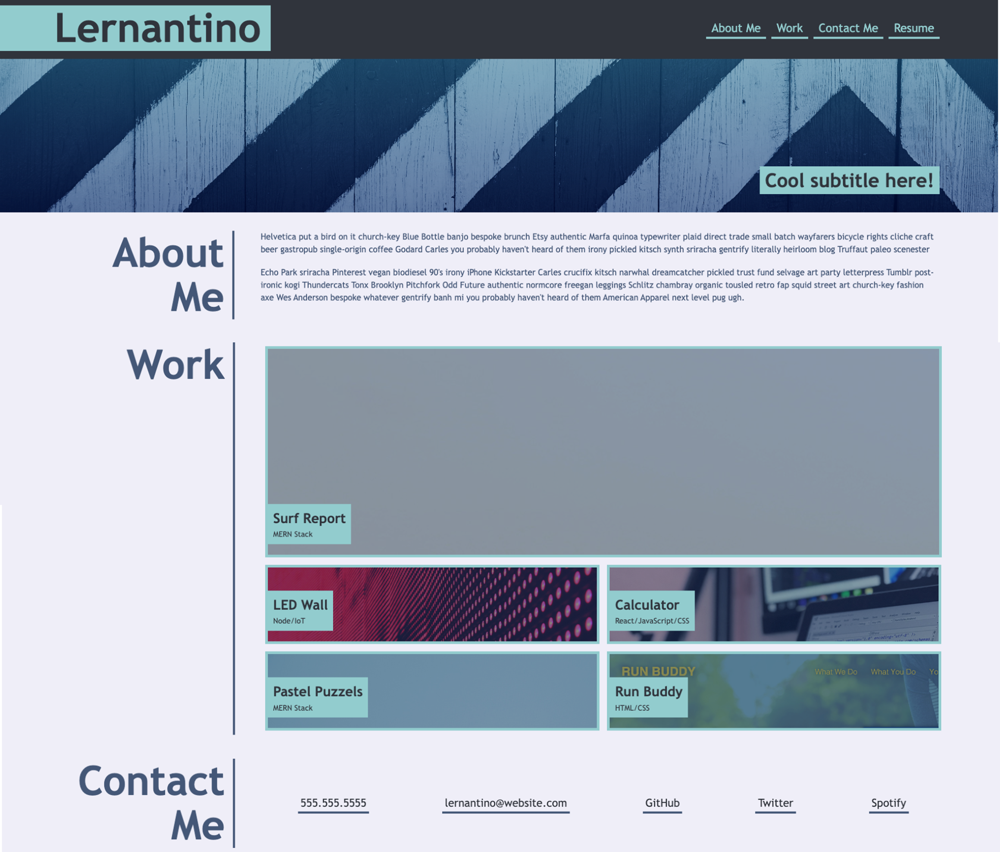

# M2-Challenge-Portfolio

## Description

This website was created as a personal portfolio. It primarily uses html and css and was built for practice during my UCF Bootcamp. 
While coding this Portfolio I learned to:

- Place figures and text within parent elements in order to size them
- Make a responsive webpage that fits multiple screen sizes
- Turn an image into a link to an external source
- Use a reset.css file in order to work without a browsers premade styling

The original User Story and Acceptance Criteria were as follows

### User Story

```
AS AN employer
I WANT to view a potential employee's deployed portfolio of work samples
SO THAT I can review samples of their work and assess whether they're a good candidate for an open position
```

### Acceptance Criteria

```
GIVEN I need to sample a potential employee's previous work
WHEN I load their portfolio
THEN I am presented with the developer's name, a recent photo or avatar, and links to sections about them, their work, and how to contact them
WHEN I click one of the links in the navigation
THEN the UI scrolls to the corresponding section
WHEN I click on the link to the section about their work
THEN the UI scrolls to a section with titled images of the developer's applications
WHEN I am presented with the developer's first application
THEN that application's image should be larger in size than the others
WHEN I click on the images of the applications
THEN I am taken to that deployed application
WHEN I resize the page or view the site on various screens and devices
THEN I am presented with a responsive layout that adapts to my viewport
```

## Link

[Mateo Wallace, Web Dev Portfolio](https://link-url-here.org)

## Screenshot



## Example Image From Assignment

The following animation shows the web application's appearance and functionality:




## Credits

Meyer, E. A., &amp; Meyer, K. S. (2022). CSS Tools: Reset CSS. meyerweb.com. Retrieved September 23, 2022, from 
     https://meyerweb.com/eric/tools/css/reset/ 
